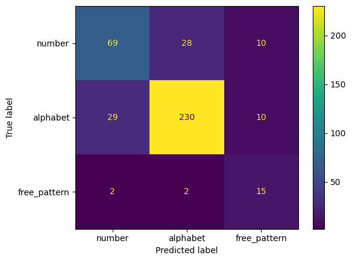
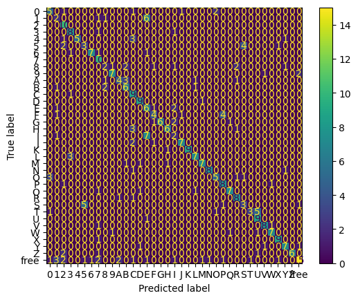
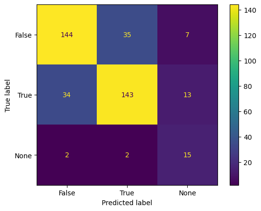

# 설치

리포지토리 복제
```
git clone https://github.com/shz295/assignment.git
```

필요한 패키지 설치
```
pip install -r api/requirements.txt
pip install -r interface/requirements.txt
```

# 사용

### Docker를 통한 실행
```
docker compose build
docker compose up
```

### 직접 실행

API 실행
```
cd api
python main.py
```
인터페이스 실행
```
cd interface
streamlit run interface.py
```

실행 후 http://localhost:8501/ 에 인터페이스 접속 가능하며 http://localhost:8000/docs 에서 API 문서 확인 가능

전처리 시각화 기능을 사용하려면 OpenCV가 FFMPeg 지원을 포함하여 빌드되어 있어야 합니다. 이는 기본적으로 라이선스 문제로 인해 사용할 수 없습니다. 그러나 Docker 이미지를 실행하는 경우에는 사용 가능합니다.

# 개요

최종 모델은 이진화된 MNIST 데이터 세트에서 훈련되고 장난감 블록 데이터 세트에서 미세 조정된 LeNet-5 CNN 아키텍처입니다. 추론 파이프라인은 다음과 같습니다.



먼저, 이미지를 파일에서 읽고 OpenCV를 사용하여 처리합니다. 보드 영역을 검출하고 대상을 더 읽기 쉽게 만들기 위해 워프를 적용합니다. 그런 다음 이미지의 크기가 224x224x3으로 조정됩니다. 그런 다음 블록을 분리하기 위해 분할이 수행됩니다. 이 분할에서 HSV 색 공간의 otsu threshold을 사용하여 두 개의 이진 마스크, 즉 주 색 블록의 마스크와 반색 블록의 마스크가 생성됩니다. 마지막으로 각 마스크를 관심 영역으로 잘라내고 28x28로 조정합니다. [이미지 전처리 과정은 이 영상을 통해 볼 수 있습니다](https://raw.githubusercontent.com/shz295/assignment/main/evaluation/preprocessing.mp4).

그런 다음 두 개의 마스크는 LeNet 모델에 입력될 수 있으며, 각각 길이 37의 벡터를 출력합니다. 이 벡터는 각 숫자, 문자 및 기타 클래스의 확률을 나타냅니다. 카테고리(숫자/알파벳/자유패턴)는 세 가지 조건을 사용하여 예측합니다. 두 벡터가 모두 '기타'에 대한 높은 확률을 가질 경우, 카테고리는 '자유 패턴'으로 예측됩니다. 그렇지 않으면, 각 벡터의 가장 확실한 선택을 취하고 이 비교를 기반으로 주 색상을 결정합니다. 그런 다음 가장 확신 있는 클래스에서 해당하는 문자 또는 숫자를 예측으로 취할 수 있으며, 카테고리가 "자유 패턴"이 아닌 경우에 해당하는 알파벳 또는 숫자의 카테고리를 쉽게 유추할 수 있습니다.

이러한 모델을 사용하여 FastAPI를 통해 간단한 RESTful API를 생성했습니다. 이 API는 Uvicorn을 통해 웹 서버로 제공됩니다. Uvicorn은 웹 서버를 8000 포트에 바인딩하고, FastAPI는 /predict/ 경로에 post 메서드로 엔드포인트를 제공합니다. 다른 포트 사용할 경우에는 --port으로 설정이 가능합니다. 이미지 파일 및 반색 예측 반환 여부 및 전처리 과정 시각화 반환 여부에 대한 옵션이 요청됩니다. 파일이 전송되면 OpenCV의 imdecode를 사용하여 전송된 바이트를 예측을 위한 numpy 배열로 변환합니다. 추론 파이프라인 자체는 위에 설명 있듯이 inference.py에 infer() 메인 함수로 설명되어 있습니다. 특정 작업을 위해 이미지 전처리가 적용되고, 예측이 수행되며 결과와 신뢰도가 반환됩니다. 카테고리(숫자/알파벳/자유 패턴)의 예측이 이루어지고, 결과에 따라 숫자/알파벳의 예측이 이루어집니다. 예측된 카테고리와 경우에 따라 자유 패턴이 아닌 특정 숫자/문자가 포함된 사전 객체가 반환됩니다. 전처리 과정 시각화 요청 받았으면 OpenCV를 사용하여 생성하고 텍스트로 인코딩되어 JSON 응답의 일부로 전송됩니다.

streamlit을 사용하여 API와 상호 작용하는 간단한 웹 인터페이스가 되어 있습니다. 이 인터페이스를 통해 이미지 파일을 업로드하고 업로드한 이미지를 표시할 수 있습니다. 적절한 이미지가 업로드되면 예측 버튼이 표시되며, 누르면 이미지가 http://localhost:8000/predict 로 전송됩니다. 선택적으로 --api_address 커맨드 라인 인수를 사용하여 API의 위치를 지정할 수 있습니다(로컬로 호스팅되지 않은 경우). 포트는 --port으로 선택도 가능합니다. 결과를 받은 후에 예측된 카테고리, 특정 숫자 또는 알파벳 문자, 그리고 신뢰도 수준이 사용자에게 제시됩니다. 옵션 선택에 따라 반색 여부 및 전처리 시각화 영상도 볼 수 있습니다.

# 접근 방법 / 시도

데이터 탐색, 전처리, 모델링 등의 첫 탐사 과정은 exploration.ipynb 파일에 적혀있습니다.

탐사 과정은 다음과 같았습니다: 먼저, 데이터셋의 레이블링 시스템과 디렉토리를 이해하려고 합니다. 데이터를 불러온 후, 데이터를 훈련 및 테스트 데이터셋으로 분할합니다. 다음으로, 데이터가 올바르게 처리되었는지 확인하기 위해 일부 이미지를 살펴봅니다. 그 다음, 이미지를 224x224 크기로 조정하고 정규화된 픽셀로 변환한 이미지에 대해 간단한 모델로 기준선 정확도를 설정합니다. 

정확도를 향상시키는 여러 가지 방법을 탐구합니다. 모델이 인식하기 쉽도록 이미지를 개선하는 방법을 찾기 위해 OpenCV를 사용합니다. 이 과정에서 이미지를 보드 크기로 왜곡시키는 작업을 수행했습니다. 배경 제거도 시도되었지만 초기에는 사용하기에 더 많은 작업이 필요하다고 결정되었습니다. 이미지 전처리 방법을 정리하고, 작성한 함수로 이루어진 파일인 preprocessing.py를 작성했습니다. 

그 후에는 ResNet50, VGG16, MobileNetV2 전이학습된 모델을 시도해봤습니다. ResNet와 VGG16은 이런 간단하고 작은 데이터량의 경우에 적합하지 않다고 판단했습니다. 설령 데이터 증강을 사용하더라도 파인튜닝 해봤자 아무 차이 보이지 않습니다. 그런데, 숫자 분류에 괜찮은 결과를 MobileNetV2를 통해 이루었습니다. 데이터 크기를 증가시키기 위해 데이터 증강을 시도하고, 숫자, 문자, 자유 패턴의 개수 차이를 고려하기 위해 클래스 가중치를 사용합니다. 이러한 탐구는 model_selection_2.ipynb에서 확인이 가능합니다. 정확도를 향상시키는 방법을 탐구한 후, 하이퍼파라미터 최적화를 위해 model_generation.ipynb이라는 새로운 파일을 만들었습니다. 먼저 GridSearchCV를 사용하여 다양한 매개변수 조합을 시도했지만, 일관적으로 RAM이 부족하여 매개변수 조합을 무작위로 시도하고 어느 정도 잘 하는 것을 선택하기로 결정했습니다. 이 방법을 통한 최종 모델 선택은 model_selection.ipynb에 설명되어 있습니다.

그러나, 'model_selection.ipynb'에서 하이퍼파라미터를 찾던 중 데이터 누출이 발견되었습니다. 훨씬 작은 데이터셋과 더 복잡한 작업에서 최상위 MNIST 모델과 유사한 점수를 받는 것은 이상했으며, 사용하지 않은 폴더에서 샘플 외 예측을 수행한 후 이것이 확인되었습니다. 실제로 모델들은 데이터셋 밖에서는 무작위 추측과 유사한 예측 능력을 가지고 있었습니다. 하나의 가설은 색상을 반전한 동일한 이미지들이 훈련 및 검증/테스트 세트 양쪽에 골고루 분포되어 있어 모델이 알지 말아야 할 데이터를 학습하게 된 것일 수 있습니다. 확실히 이것은 데이터 누출의 원인이 될 수 있지만, 'r'이 아닌 이미지만 로드하여 이를 제어한 후에도 차이는 그다지 크지 않았습니다. 또한 다른 고려 사항으로는 다른 파일명을 가진 중복 이미지가 있는지 여부였지만, 중복 파일명이 존재하지 않는지 SSIM 또는 데이터 로딩 방법을 비교해본 결과는 아무 변화가 없었습니다. 오염된 테스트 세트의 처리나 클래스 계층화의 차이도 유의미한 결과를 보여주지 않았습니다. 이미지 전처리를 검토한 결과 두 경우 모두 동일한 이미지가 보였습니다. 결국, 이상적이지는 않지만 '추가' 디렉토리를 테스트/검증용으로 사용하기로 결정되었으며, '자유패턴'에서 일치하는 클래스 계층화를 가진 몇 개의 무작위 디렉토리도 선택되었습니다. '원샷' 스타일 모델의 가능성도 탐구되었는데, 직접 37개 카테고리 중 하나를 선택하는 것이 처음에는 3개 카테고리의 모델을 선택한 다음 해당 문자/숫자를 갖는 다른 모델을 선택하는 것과 유사한 결과를 제공할지 여부를 확인하기 위한 것이었습니다. 결국 이 모델은 두 작업 모두에서 성능이 떨어졌지만 이 논리로 최종 모델에 사용했습니다.

이 시점에서, 모델의 정확도에 대한 불만이 컸고, 과제를 다시 고려하기 시작했습니다. 특히, 주요 색상과 반대 색상을 구별하지 않으면, 상대적으로 적은 양의 데이터로 각 카테고리의 두 패턴을 인식하는 것이 매우 어려울 것으로 보였습니다. 이에 따라 다시 데이터 전처리 파이프라인에 작업을 시작했습니다. 이를 위해 color_segmentation.ipynb, warp_to_board.ipynb 및 back_projection.ipynb 노트북을 작성했습니다. 이 노력을 통해 입력 공간의 차원을 MNIST와 유사한 문제로 크게 축소시킬 수 있었으며, 더 많은 클래스와 반대 색상의 복잡성이 추가된 형태로 변환할 수 있었습니다. 이를 고려하여 MNIST 데이터셋에 유명한 LeNet-5 모델을 적용하기로 결정했습니다. 이 최종 모델 선택 과정은 lenet.ipynb 파일에 기록되어 있습니다.

모델을 처음부터 훈련한 결과는 이미 꽤 괜찮았지만, 모델은 자유 패턴을 판단하는 데 특히 어려움을 겪었고, 몇몇 쌍은 매우 잘못 분류되었습니다. 훈련 데이터를 늘리기 위해, 먼저 모델을 MNIST의 60,000개의 손으로 쓴 숫자 데이터로 훈련하였으며, 이것은 내 전처리 결과와 매우 유사했습니다. 그런 다음 MNIST의 10개 출력 소프트맥스 레이어를 문자와 숫자의 분류를 위한 37개 출력 소프트맥스 레이어로 교체했습니다. 출력 레이어를 제외한 모든 레이어를 고정하고, 장난감 블록 훈련 데이터에서 손실이 수렴할 때까지 훈련했습니다. 그런 다음 상위 두 개의 완전 연결된 레이어를 고정 해제하고 학습률을 낮추어 다시 훈련했습니다. 결과적으로 처음부터 훈련된 모델보다 훨씬 균형 잡힌 모델이 생성되었지만, 정확도는 그다지 높지 않았습니다. 혼동 행렬을 살펴보면 심각하게 잘못 분류된 쌍이 훨씬 적고, 중요한 것은 자유 패턴도 매우 잘 분류되었다는 점입니다. 또한 훈련 손실과 검증 손실이 훨씬 비슷하여 과적합의 징후가 적었습니다. 결과에 만족하여 이전에 설명한대로 새로운 추론 파이프라인을 정의하고 테스트 세트에서 평가했습니다. 점수는 검증과 유사하며, 실제로 인터페이스를 통해 과제에 대한 정확도가 만족스러워 보였습니다.


# 평가

테스트 세트의 최종 평가는 다음과 같습니다.
| 모델                    | 정확도  |
|-------------------------|-------|
| 숫자/알파벳/자유패턴 인식  | 79.49 |
| 숫자/알파벳 인식          | 61.77 |
| 반색 인식                | 74.43 |

숫자/알파벳/자유패턴 인식 오차행렬 |           범주 오차행렬           |       반색 여부 오차행렬      |
:----------------------------:|:-------------------------------:|:---------------------------:|
    |    |     |

# 결론

이 문제에서 일부 쌍은 거의 동일하며, 일반적으로 5-S, 1-I, O-0, R-A 및 B-8을 구별하는 것은 인간조차 어렵다고 기대할 수 없습니다. 그러나 이러한 경우를 무시하고 나면 이 작업은 매우 간단하며 매우 높은 정확도를 기대할 수 있습니다. 작업을 개선하기 위해 전처리 파이프라인에서 "팽창(dilate)" 및 "침식(erode)"과 같은 작업을 사용하여 데이터 증강을 수행할 수 있으며, 이를 통해 훈련 가능한 데이터 양을 크게 늘릴 수 있습니다. 또한 고려해 볼 아이디어 중 하나는 의미론적 분할(semantic segmentation)인데, 이를 사용하여 두 색상의 모양을 하나의 모델에서 예측할 수 있습니다. 현재 모델은 완전히 별개로 예측함으로써 유용한 정보를 일부 잃어버리기 때문에 개선의 여지가 있을 수 있습니다. 처음에는 문제가 매우 간단해 보였지만, 조금 생각하고 나니 처음에 보이던 것보다 더 깊이가 있었습니다. 시도해 볼 만한 흥미로운 것들이 많았고, 이를 해결하면서 정말 즐거움을 느꼈습니다.
